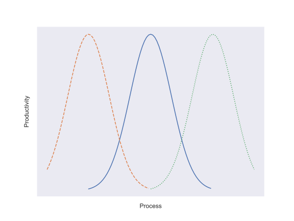

# The Anatomy of a Successful Software Engineering Capability

[Software is eating the world.](https://a16z.com/2011/08/20/why-software-is-eating-the-world/) Published in 2011, this prediction has shown real staying power. Many companies benefit greatly by writing their own software, even in industries that traditionally contracted it. For example, by writing their own software, [Tesla was in a better position to respond to chip shortages than its competitors by recoding to available hardware.](https://www.utilitydive.com/news/tesla-chip-semiconductor-shortage/628150/) By being able to deploy bespoke software solutions, companies can customize their software to meet their needs more precisely than what is available with strictly off-the-shelf offerings.

While the promise of managing their own software development capability may sound convincing, it is easier to run a software engineering function poorly than well. The better a software engineering capability is run, the more quantifiable value is added by that capability. For instance, the number of additional vehicles Tesla was able to manufacture and sell by adapting to available chips is one measure of added value. The faster it was able to adapt its software, the more additional vehicles (and therefore added value) it would realize.

The purpose of this article is to describe what I think is the best way to organize and structure a software engineering capability from an operational perspective to maximize value. I will not discuss best practices in coding, but rather how to deploy and configure code development tools in a way that provides a foundation for sustainable and scalable software development.

## What does it mean to have sustainable software development?

A sustainable software engineering capability is one that is able to continuously deliver added value as time goes on at a consistent pace. Unfortunately, to inexperienced software engineers identifying unsustainable practices may happen long after said practices are already adopted.

The early stages of development of new software are easy to show rapid progress. A *new* software project starts with no features, no bugs, no users, and very frequently few developers. Under such ideal conditions, churning out new code and features is fast, fun, and exciting. The software remains fairly simple, and therefore easily conceptualized in its entirety by the small team of developers that worked to start it.

As a successful project matures its number of features and bugs grows alongside the size of its user base and development team. It is at this stage that many poorly-run software engineering functions encounter problems. Poor software engineering practices can make teamwork challenging and inefficient, leading to a sharp decline in pace of delivering features and fixing (or even identifying) bugs.

A sustainable software engineering function does not suffer from these inefficiencies. They can onboard new team members and enable them to start contributing quickly. Identifying and fixing bugs is streamlined as much as possible, resulting in software that is more robust and reliable.

## Process and Sustainable Software Development

I've found one of the key differentiators between well-run and poorly-run software projects is the effective use of [process](https://en.wikipedia.org/wiki/Software_development_process).

In every case, there is a tradeoff to make between too much process and too little process. Process lends itself to reproducibility and reliability and is straightforward to automate. Automating process can significantly boost developer productivity by freeing time that would otherwise be spent executing steps of the process. The reproducibility conferred by automation removes many potential barriers to identifying (and therefore fixing) bugs.

On the other hand, process introduces rigidity in development that can itself hinder progress. For example, requiring all changes to undergo the same design, consensus, coding, review, and extensive testing routines introduces substantial overhead to making small changes and may promote suboptimal development practices like large pull requests while encouraging developers to bundle critical fixes with larger features to reduce the time spent executing process.

The challenge becomes to find the right balance – that is, adopting process that useful and provides value while avoiding that which does not. Unfortunately, in the earliest days of a software engineering department, *all* process may feel burdensome.

However, those teams that opt to forego implementing process inevitably become paralyzed by that choice as both the team and code base grows. Identifying and reproducing bugs that appear in production becomes a chore as significant time needs to be spent determining what *exact* version of the code was deployed, *how* it was deployed, and reproducing the issue in a way that it can be reliably fixed. The complexity of deploying software grows as new features require small tweaks which continue to build up. Fear of breaking the house of cards drives teams to lengthen the deployment schedule and increase the effort expended each time.

Software developers rightly recognize this as a description of [technical debt](https://en.wikipedia.org/wiki/Technical_debt) – and that's exactly what this is. Savvy use of process can help limit the accumulation of technical debt in the *operational* aspect of software development – specifically the mechanics of collaborating on code development and releasing or deploying software products.

# Designing Sustainable Software Engineering

For startups or other small companies that are adding a software engineering capability for the first time, the small core team of software developers may lack the experience needed to establish sound practices at the outset. The purpose of this article until this point has been to convince you of the importance of adopting and employing modern software development tooling. The rest is devoted to what tooling is needed, and how it should be employed to establish your software engineering capability on a sound footing.
