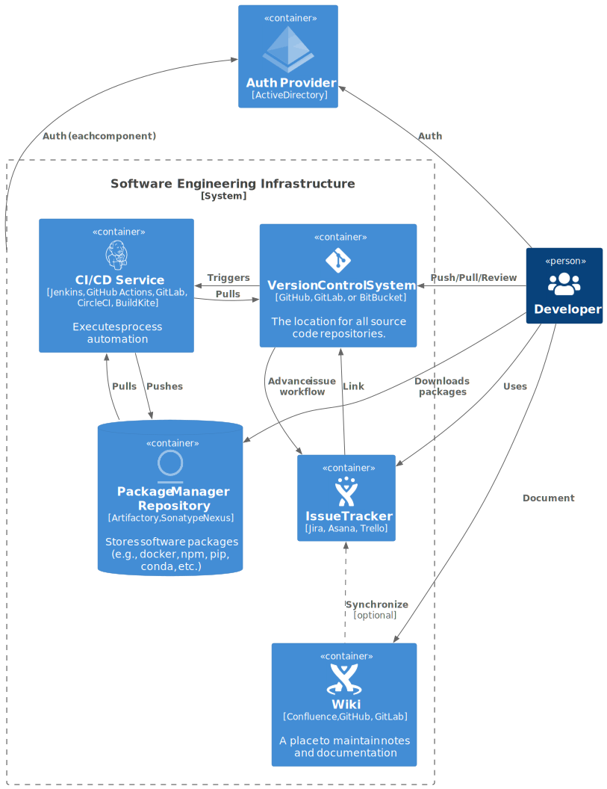

# The Anatomy of a Successful Software Engineering Capability

[Software is eating the world.](https://a16z.com/2011/08/20/why-software-is-eating-the-world/) Published in 2011, this prediction has shown real staying power. Many companies benefit greatly by writing their own software, even in industries that traditionally contracted it. For example, by writing their own software, [Tesla was in a better position to respond to chip shortages than its competitors by recoding to available hardware.](https://www.utilitydive.com/news/tesla-chip-semiconductor-shortage/628150/) By being able to deploy bespoke software solutions, companies can customize their software to meet their needs more precisely than what is available with strictly off-the-shelf offerings.

While the promise of managing their own software development capability may sound convincing, it is easier to run a software engineering function poorly than well. The better a software engineering capability is run, the more quantifiable value is added by that capability. For instance, the number of additional vehicles Tesla was able to manufacture and sell by adapting to available chips is one measure of added value. The faster it was able to adapt its software, the more additional vehicles (and therefore added value) it would realize.

The purpose of this article is to describe what I think is the best way to organize and structure a software engineering capability from an operational perspective to maximize value. I will not discuss best practices in coding, but rather how to deploy and configure code development tools in a way that provides a foundation for sustainable and scalable software development.

## What does it mean to have sustainable software development?

A sustainable software engineering capability is one that is able to continuously deliver added value as time goes on at a consistent pace. Unfortunately, to inexperienced software engineers identifying unsustainable practices may happen long after said practices are already adopted.

The early stages of development of new software are easy to show rapid progress. A *new* software project starts with no features, no bugs, no users, and very frequently few developers. Under such ideal conditions, churning out new code and features is fast, fun, and exciting. The software remains fairly simple, and therefore easily conceptualized in its entirety by the small team of developers that worked to start it.

As a successful project matures its number of features and bugs grows alongside the size of its user base and development team. It is at this stage that many poorly-run software engineering functions encounter problems. Poor software engineering practices can make teamwork challenging and inefficient, leading to a sharp decline in the pace of delivering features and fixing (or even identifying) bugs.

A sustainable software engineering function does not suffer from these inefficiencies. They can onboard new team members and enable them to start contributing quickly. Identifying and fixing bugs is streamlined as much as possible, resulting in software that is more robust and reliable.

## Process and Sustainable Software Development

I've found one of the key differentiators between well-run and poorly-run software projects is the effective use of [process](https://en.wikipedia.org/wiki/Software_development_process).

In every case, there is a tradeoff to make between too much process and too little process. Process lends itself to reproducibility and reliability and is straightforward to automate. Automating process can significantly boost developer productivity by freeing time that would otherwise be spent executing steps of the process. The reproducibility conferred by automation removes many potential barriers to identifying (and therefore fixing) bugs.

On the other hand, process introduces rigidity in development that can itself hinder progress. For example, requiring all changes to undergo the same design, consensus, coding, review, and extensive testing routines introduces substantial overhead to making small changes and may promote suboptimal development practices like large pull requests while encouraging developers to bundle critical fixes with larger features to reduce the time spent executing process.

The challenge becomes to find the right balance – that is, adopting process that useful and provides value while avoiding that which does not. Unfortunately, in the earliest days of a software engineering department, *all* process may feel burdensome.

However, those teams that opt to forego implementing process inevitably become paralyzed by that choice as both the team and code base grows. Identifying and reproducing bugs that appear in production becomes a chore as significant time needs to be spent determining what *exact* version of the code was deployed, *how* it was deployed, and reproducing the issue in a way that it can be reliably fixed. The complexity of deploying software grows as new features require small tweaks which continue to build up. Fear of breaking the house of cards drives teams to lengthen the deployment schedule and increase the effort expended each time.

Software developers rightly recognize this as a description of [technical debt](https://en.wikipedia.org/wiki/Technical_debt) – and that's exactly what this is. Savvy use of process can help limit the accumulation of technical debt in the *operational* aspect of software development – specifically the mechanics of collaborating on code development and releasing or deploying software products.

# Designing Sustainable Software Engineering

For startups or other small companies that are adding a software engineering capability for the first time, the small core team of software developers may lack the experience needed to establish sound practices at the outset. The purpose of this article until this point has been to convince you of the importance of adopting and employing modern software development tooling. The rest is devoted to what tooling is needed, and how it should be employed to establish your software engineering capability on a sound footing.

I've found that a sufficient nucleus that helps foster a robust and sustainable software engineering capability can be deployed via the components shown below.

In the sections below, I'll briefly describe the importance of each component as well as the choices of available Software as a Service (SaaS) offerings that satisfy each one.

## Auth Provider

The Auth Provider supplies both *Authentication* (establishing that a user or application *is* who they claim to be) and *Authorization* (declares that the authenticated user has the permission to do something).

Having a centralized Auth Provider is critical to scaling an organization. While a company may start out by employing a small handful of services, those few services quickly grows. Without a centralized Auth Provider, each application will need to maintain its own internal list of users making it effectively impossible to implement security standards surrounding multifactor authentication and strength of password.

Any tool you onboard into your organization should integrate using some standardized Auth mechanism, like SAML 2.0, to your centralized Auth Provider. This is a feature known as "Single Sign-On", or SSO – that is you are able to sign into every company service or system with a single account.

### Recommendation

You typically have little choice in this Auth Provider, as it is usually established with the company. Common choices are Azure Active Directory (from Microsoft), or an offering from Okta or Auth0. Any of these will support SAML 2.0 and enable SSO.

## Version Control System (VCS)

Building modern, collaborative software projects is impossible without a Version Control System. The most common commercial options for these platforms are [GitHub](https://github.com), [GitLab](https://gitlab.com), and [BitBucket](https://bitbucket.org). There are, of course, many others.

The VCS will serve as the centralized hub that drives almost all of your software engineering process. It is here that you will define automations of your developer operations, code review policy, and tag versioned releases of your source code.

### Recommendation

I've used all 3 in professional settings. I've managed a private GitLab instance for a community-driven project and both GitHub and BitBucket Server at commercial companies.

I would personally recommend GitHub or GitLab, as the integrated CI/CD offering provided with the platform allows you to leverage the same platform for for both VCS and CI/CD.

## CI/CD Service

The CI/CD service – standing for Continuous Integration and Continuous Deployment (or Continuous Delivery) – is the platform that allows you to automate developer operations. You will use it to automatically run a test suite to gate pull requests to drive code quality, and it provides a platform to automate building and deploying software packages.

### Recommendation

If you selected either GitHub or GitLab as the VCS provider, I highly recommend using either GitHub Actions or GitLab CI, respectively. Both are mature, capable platforms that will allow you to do almost anything you want.

Jenkins is a highly capable platform, and CloudBees offers commercial support for it as a platform. However, I'd recommend platforms with a lower barrier to entry such as Azure Pipelines, CircleCI, or BuildKite.

## Package Manager Repositories

This piece is critical and often overlooked. Package manager repositories provide a place to push software artifacts that can be pulled into development environments by the software engineering team. Most programming languages come with package managers built-in, summarized for some languages below.

| Language | Package Manager | Public Package Repository |
|----------|-------|----|
| Python | pip | pypi.org |
| Python | conda | conda.anaconda.org |
| JavaScript | npm | registry.npmjs.org |
| C# | nuget | nuget.org |
| Docker | docker | hub.docker.co | 
| Rust | cargo | crate.io |
| go | go get | git repositories |
| swift | Swift Package Manager | swift.org |
| Kubernetes | helm | Decentralized - many organizations host their own |

Even if your organization only uses one, or predominantly one, programming language, you are likely to use multiple package managers for different technologies in your stack. For instance, if you employ Python code deployed in a Kubernetes environment you are likely to make use of pip or conda packages, Docker (container) images, and possibly helm charts.

Publishing your libraries to package manager repositories makes it easy to deploy well-defined, reproducible production environments to any computer infrastructure in your organization. This includes developer machines, a private data center, or either public or private clouds. Environments can often be declared in a single file that lists the packages with any relevant version pins.

While tags in your VCS can often be modified, you can establish policy in your package repositories to prohibit overwriting or deleting packages which eliminates uncertainty surrounding the *exact* version of the code deployed in production that encountered a reported bug.

### Recommendation

If your company is exclusively publishing open source packages and libraries, you can publish to public repositories directly, setting up a single company-wide service account to provide push access for your packages from automated pipelines run from your CI/CD service.

However, if any of your software is exclusively for internal use and you want to restrict access to your software engineering team, then most package managers require paid service contracts to provide private package repositories.

Alternatively, you can use platforms that support many different package manager protocols directly, using the same platform to host all of your different package types.

Both [GitHub](https://github.com/features/packages) and [GitLab](https://docs.gitlab.com/ee/user/packages/package_registry/supported_package_managers.html) offer repositories for a small number of package managers. If those are sufficient, I would recommend using GitHub or GitLab. Dedicated package repository services are extremely valuable and well worth the monthly expense. Both [JFrog Artifactory](https://jfrog.com/artifactory/) and [Sonatype Nexus](https://www.sonatype.com/products/nexus-repository) satisfy the requirements here.

I recommend using Artifactory, as it is the only platform with a fully managed option (Nexus requires you to provision and maintain your own infrastructure to host it).